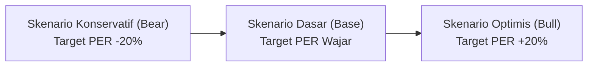

# 📖 Dokumentasi Perhitungan Fundamental & Margin of Safety (MOS)
**PintarSaham Intelligence — Panduan Metodologi & Rumus Finansial**

Dokumen ini menjelaskan secara rinci seluruh konsep, rumus matematika, komponen data riil dari Yahoo Finance, serta contoh perhitungan langkah demi langkah untuk menentukan **Harga Wajar (*Intrinsic Value*)** dan **Margin of Safety (MOS)** saham di Bursa Efek Indonesia (IDX).

---

## 📌 Daftar Isi
1. [Prinsip Dasar Margin of Safety (MOS)](#1-prinsip-dasar-margin-of-safety-mos)
2. [Komponen Data Riil dari Yahoo Finance](#2-komponen-data-riil-dari-yahoo-finance)
3. [Rumus Perhitungan Harga Wajar (*Fair Value*)](#3-rumus-perhitungan-harga-wajar-fair-value)
4. [Rumus Perhitungan Margin of Safety (MOS %)](#4-rumus-perhitungan-margin-of-safety-mos-)
5. [Penentuan Target Kelipatan Valuasi (Target PER & PBV)](#5-penentuan-target-kelipatan-valuasi-target-per--pbv)
6. [Studi Kasus & Contoh Perhitungan Riil Saham IDX](#6-studi-kasus--contoh-perhitungan-riil-saham-idx)
7. [Interpretasi & Klasifikasi Zona MOS](#7-interpretasi--klasifikasi-zona-mos)
8. [Sensitivitas Skenario (Konservatif, Dasar, Optimis)](#8-sensitivitas-skenario-konservatif-dasar-optimis)

---

## 1. Prinsip Dasar Margin of Safety (MOS)

Konsep **Margin of Safety (MOS)** diperkenalkan oleh **Benjamin Graham** dan **David Dodd** dalam buku legendaris *Security Analysis* (1934) serta dipopulerkan kembali dalam *The Intelligent Investor* (1949).

> **Prinsip Utama**:
> *"Margin of Safety adalah selisih diskon antara harga pasar saham saat ini dengan nilai intrinsik (harga wajar) perusahaan yang dihitung dari kinerja fundamentalnya."*

Tujuan utama MOS adalah memberikan **bantalan pengaman (*cushion*)** bagi investor terhadap:
1. Kesalahan dalam proyeksi masa depan (*forecasting error*).
2. Volatilitas dan sentimen negatif pasar saham jangka pendek.
3. Risiko tak terduga dalam operasional industri/bisnis perusahaan.

---

## 2. Komponen Data Riil dari Yahoo Finance

Seluruh perhitungan fundamental menggunakan data pasar dan laporan keuangan nyata yang ditarik secara otomatis melalui `yfinance`:

| Parameter | Nama Field di Yahoo Finance | Deskripsi & Formula Dasar | Contoh Nilai Riil (BBCA) |
| :--- | :--- | :--- | :--- |
| **Harga Terakhir ($P$)** | `currentPrice` / `close` | Harga transaksi penutupan terakhir di bursa efek. | **Rp6.225** |
| **EPS Riil ($EPS$)** | `trailingEps` | Laba bersih 12 bulan terakhir (*Trailing Twelve Months*) dibagi total saham beredar. $$EPS = \frac{\text{Net Income (TTM)}}{\text{Shares Outstanding}}$$ | **Rp471,86** |
| **BVPS Riil ($BVPS$)** | `bookValue` | Nilai buku ekuitas bersih per lembar saham. $$BVPS = \frac{\text{Total Ekuitas}}{\text{Shares Outstanding}}$$ | **Rp2.201,51** |
| **Trailing PER** | `trailingPE` | Rasio harga saat ini dibagi EPS riil 12 bulan terakhir. $$PER = \frac{\text{Harga Pasar}}{EPS}$$ | **13,19x** |
| **Price to Book (PBV)** | `priceToBook` | Rasio harga pasar saat ini dibagi nilai buku per saham. $$PBV = \frac{\text{Harga Pasar}}{BVPS}$$ | **2,82x** |
| **Return on Equity (ROE)** | `returnOnEquity` | Efisiensi perusahaan mencetak laba dari ekuitas pemegang saham. $$ROE = \frac{\text{Net Income}}{\text{Total Ekuitas}}$$ | **21,8%** |
| **Dividend Yield** | `dividendYield` | Persentase dividen tahunan terhadap harga pasar saham. | **~6,1%** |

---

## 3. Rumus Perhitungan Harga Wajar (*Fair Value*)

Dashboard PintarSaham menyediakan dua pendekatan valuasi kelipatan (*multiple valuation*) yang umum digunakan para analis ekuitas:

### A. Pendekatan Kelipatan Laba (Price-to-Earnings / PER)
Pendekatan ini paling cocok untuk perusahaan dengan laba bersih yang konsisten bertumbuh (perbankan, konsumer, telekomunikasi):

$$\mathbf{\text{Harga Wajar}_{\text{PER}} = \text{EPS}_{\text{riil}} \times \text{Target PER}}$$

* **$\text{EPS}_{\text{riil}}$**: Laba bersih per lembar saham 12 bulan terakhir (`trailingEps`).
* **$\text{Target PER}$**: Kelipatan valuasi wajar yang ditetapkan berdasarkan rata-rata historis 3–5 tahun atau benchmark sektor terkait.

### B. Pendekatan Nilai Buku (Price-to-Book / PBV)
Pendekatan ini cocok untuk sektor perbankan, keuangan, atau perusahaan padat aset (*asset-heavy*):

$$\mathbf{\text{Harga Wajar}_{\text{PBV}} = \text{BVPS}_{\text{riil}} \times \text{Target PBV}}$$

* **$\text{BVPS}_{\text{riil}}$**: Nilai buku ekuitas per lembar saham (`bookValue`).
* **$\text{Target PBV}$**: Kelipatan nilai buku wajar yang layak diberikan dengan mempertimbangkan kualitas ROE perusahaan.

---

## 4. Rumus Perhitungan Margin of Safety (MOS %)

Setelah Harga Wajar diperoleh, Margin of Safety (MOS) dihitung dengan membandingkan harga pasar saat ini terhadap harga wajarnya:

$$\mathbf{\text{MOS (\%)} = \left( 1 - \frac{\text{Harga Pasar Sekarang}}{\text{Harga Wajar}} \right) \times 100\%}$$

Atau dalam bentuk rasio selisih langsung:

$$\mathbf{\text{MOS (\%)} = \frac{\text{Harga Wajar} - \text{Harga Pasar Sekarang}}{\text{Harga Wajar}} \times 100\%}$$

---

## 5. Penentuan Target Kelipatan Valuasi (Target PER & PBV)

Agar perhitungan objektif dan tidak bias, sistem menetapkan standar kelipatan valuasi dasar (*default baseline*) berdasarkan karakteristik industri di Indonesia:

| Sektor / Industri | Karakteristik Bisnis | Target PER Wajar Acuan | Target PBV Wajar Acuan |
| :--- | :--- | :---: | :---: |
| **Bank Big 4 (BBCA, BBRI, BMRI, BBNI)** | Kualitas aset prima, ROE tinggi (15–22%), CASA kuat. | **13,0x – 16,0x** | **2,0x – 3,2x** |
| **Konsumer Primer (ICBP, INDF, MYOR)** | Pendapatan defensif, pangsa pasar kebutuhan pokok. | **14,0x – 17,0x** | **1,8x – 2,5x** |
| **Telekomunikasi & Infrastruktur (TLKM, ISAT)** | Arus kas operasi stabil, dividen rutin, belanja modal teratur. | **13,0x – 15,0x** | **1,8x – 2,2x** |
| **Konglomerasi & Otomotif (ASII)** | Portofolio terdiversifikasi, sensitif siklus ekonomi. | **9,0x – 11,0x** | **1,0x – 1,3x** |
| **Energi & Komoditas (ADRO, PTBA)** | Siklikal komoditas global, pembagian dividen jumbo. | **6,0x – 8,5x** | **0,9x – 1,3x** |
| **Kesehatan / Rumah Sakit (MIKA, HEAL)** | Margin operasi tinggi, neraca kas bersih (*net-cash*). | **24,0x – 28,0x** | **2,5x – 3,5x** |

> 💡 **Fleksibilitas Pengguna**: Pengguna dapat mengubah Target PER dan PBV kapan saja melalui slider interaktif di halaman detail saham untuk menguji skenario valuasi pribadi.

---

## 6. Studi Kasus & Contoh Perhitungan Riil Saham IDX

Berikut simulasi perhitungan langkah demi langkah menggunakan data riil Yahoo Finance:

### Contoh 1: PT Bank Central Asia Tbk (BBCA)
* **Harga Pasar Sekarang ($P$)**: Rp6.225
* **EPS Riil**: Rp471,86
* **BVPS Riil**: Rp2.201,51
* **Target PER Dasar**: 15,0x

$$\text{Harga Wajar} = \text{Rp471,86} \times 15{,}0 = \mathbf{Rp7.078}$$
$$\text{MOS (\%)} = \left( 1 - \frac{\text{Rp6.225}}{\text{Rp7.078}} \right) \times 100\% = (1 - 0{,}8795) \times 100\% = \mathbf{+12{,}05\%}$$
* **Hasil**: BBCA memiliki Margin of Safety sebesar **+12,1%** (undervalued moderat).

---

### Contoh 2: PT Telkom Indonesia (Persero) Tbk (TLKM)
* **Harga Pasar Sekarang ($P$)**: Rp2.480
* **EPS Riil**: Rp247,50
* **Target PER Dasar**: 14,0x

$$\text{Harga Wajar} = \text{Rp247,50} \times 14{,}0 = \mathbf{Rp3.465}$$
$$\text{MOS (\%)} = \left( 1 - \frac{\text{Rp2.480}}{\text{Rp3.465}} \right) \times 100\% = (1 - 0{,}7157) \times 100\% = \mathbf{+28{,}43\%}$$
* **Hasil**: TLKM memiliki Margin of Safety sebesar **+28,4%** (saham terdiskon menarik, MOS $\ge 25\%$).

---

### Contoh 3: Kasus Saham yang Lebih Mahal dari Nilai Wajar (Overvalued)
Misalkan suatu saham memiliki:
* **Harga Pasar Sekarang ($P$)**: Rp5.000
* **EPS Riil**: Rp250
* **Target PER Wajar**: 14,0x

$$\text{Harga Wajar} = \text{Rp250} \times 14{,}0 = \mathbf{Rp3.500}$$
$$\text{MOS (\%)} = \left( 1 - \frac{\text{Rp5.000}}{\text{Rp3.500}} \right) \times 100\% = (1 - 1{,}4286) \times 100\% = \mathbf{-42{,}86\%}$$
* **Hasil**: Nilai MOS adalah **-42,9%** (negatif). Artinya harga saat ini 42,9% lebih mahal dari nilai wajar fundamentalnya (tidak ada ruang pengaman).

---

## 7. Interpretasi & Klasifikasi Zona MOS

Untuk memudahkan investor membaca peluang dan risiko, dashboard mengelompokkan nilai MOS ke dalam 4 zona:

| Rentang Nilai MOS | Klasifikasi Status | Indikator Visual | Makna Strategi Investasi |
| :---: | :---: | :---: | :--- |
| **$\text{MOS} \ge +25\%$** | **Sangat Menarik (*Deep Value*)** | 🟢 Hijau Tua | Harga pasar memiliki diskon yang sangat lebar terhadap nilai wajarnya. Ruang pengaman sangat memadai. |
| **$+10\% \le \text{MOS} < +25\%$** | **Menarik (*Undervalued*)** | 🟢 Hijau Muda | Saham diperdagangkan dengan diskon wajar. Risiko penurunan harga relatif terbatas. |
| **$0\% \le \text{MOS} < +10\%$** | **Harga Wajar (*Fair Value*)** | 🔵 Biru | Harga pasar mencerminkan nilai intrinsik perusahaan secara seimbang. |
| **$\text{MOS} < 0\%$** | **Premium / Mahal (*Overvalued*)** | 🔴 Merah | Harga pasar melampaui estimasi nilai wajar fundamentalnya. Diperlukan pertumbuhan laba yang lebih tinggi untuk membenarkan harga ini. |

---

## 8. Sensitivitas Skenario (Konservatif, Dasar, Optimis)

Untuk mengantisipasi ketidakpastian siklus bisnis masa depan, dashboard menerapkan rentang sensitivitas 3 skenario:

1. **Skenario Konservatif (*Bear Case*)**:
   Target PER dikurangi 20% dari asumsi dasar. Menguji apakah saham masih aman dipertahankan seandainya ekonomi melambat atau pertumbuhan laba di bawah ekspektasi.
2. **Skenario Dasar (*Base Case*)**:
   Target PER pada kelipatan wajar historis/slider aktif.
3. **Skenario Optimistis (*Bull Case*)**:
   Target PER dinaikkan 20% di atas asumsi dasar. Menggambarkan potensi valuasi apabila perusahaan membukukan pertumbuhan laba di atas konsensus.

---

## 📌 Ringkasan Implementasi Sistem
* **Sumber Data Pasar**: Yahoo Finance API via `yfinance` (`trailingEps`, `bookValue`, `currentPrice`, `trailingPE`, `priceToBook`).
* **Penyimpanan Lokal**: [`market_data.json`](market_data.json) & [`market_data.js`](market_data.js).
* **Eksekusi Frontend**: [`PintarSaham_Dashboard_Interaktif.html`](PintarSaham_Dashboard_Interaktif.html) pada fungsi `valuation(s)` dan `mos(s)`.
